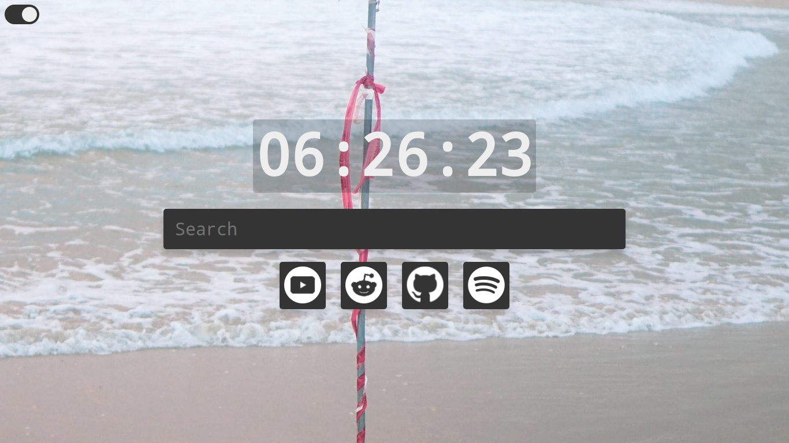

# Simple New Tab Page

A simple New Tab Page for Chromium-based Browsers.



## Features
- Random Wallpaper using [unsplash]([https://link](https://unsplash.com/)).
- Search bar. 
- Bookmarks.

## Modifying

Edit screen resolution and wallpaper search tags from css file by changing the `--wallpaper` variable.

## Setup

 1. Cone this repo.
   ```git clone https://github.com/Karem34/New-Tab```
 2. Go to [extension](chrome://extensions/).
 3. Enable Developer mode.
 4. Click on Load unpacked and select the folder.

## License

Licensed under the [MIT License](LICENSE).
